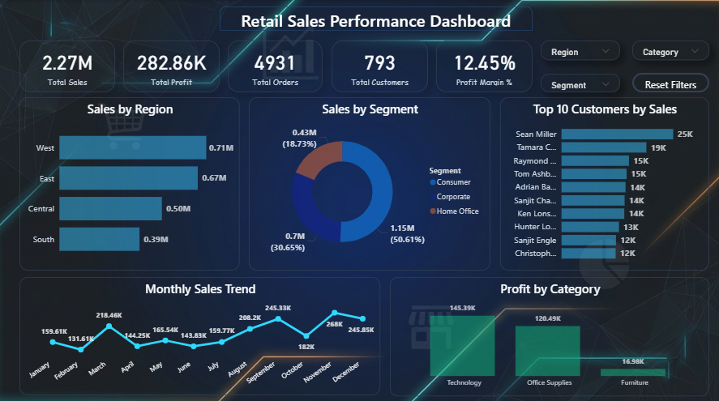

# Retail Sales Performance Dashboard



## Overview

The Retail Sales Performance Dashboard is an end-to-end data analytics project developed using SQL and Power BI. The project focuses on analyzing retail sales data to identify business trends, customer behavior, regional performance, and profitability through an interactive dashboard.

The dashboard enables users to monitor key performance indicators (KPIs), compare sales across regions and customer segments, identify top customers, and analyze monthly sales trends using interactive filters.

---

## Objectives

- Analyze overall sales and profit performance.
- Compare sales across different regions.
- Identify the most profitable product categories.
- Track monthly sales trends.
- Identify the top customers based on sales.
- Analyze customer segment contribution.
- Build an interactive dashboard for business decision-making.

---

## Dashboard Preview

The dashboard includes the following components:

- KPI Cards
  - Total Sales
  - Total Profit
  - Total Orders
  - Total Customers
  - Profit Margin

- Interactive Filters
  - Region
  - Segment
  - Category
  - Reset Filters

- Visualizations
  - Sales by Region
  - Sales by Segment
  - Monthly Sales Trend
  - Top 10 Customers by Sales
  - Profit by Category

---

## Key Performance Indicators

| KPI | Description |
|------|-------------|
| Total Sales | Overall revenue generated |
| Total Profit | Total profit earned |
| Total Orders | Number of customer orders |
| Total Customers | Number of unique customers |
| Profit Margin | Profit percentage over total sales |

---

## Business Insights

- The West region generated the highest sales.
- The Technology category produced the highest profit.
- Consumer customers contributed the largest share of total sales.
- Monthly sales trends highlight seasonal fluctuations.
- The dashboard allows dynamic analysis using interactive filters.

---

## Tools and Technologies

- Power BI
- SQL (MySQL)
- Microsoft Excel / CSV
- Data Visualization
- Data Analysis

---

## Project Files

```
Retail-Sales-Performance-Dashboard
│
├── Dashboard_SS.png
├── Retail_sales_powerbi.pbix
├── retail_sales_analysis.sql
└── Sample-Superstore.csv
```

---

## SQL Analysis

The SQL script includes queries for:

- Total Sales
- Total Profit
- Total Orders
- Total Customers
- Profit Margin
- Sales by Region
- Sales by Segment
- Profit by Category
- Monthly Sales Analysis
- Top Customers Analysis

---

## Dashboard Features

- Interactive slicers for filtering data.
- Dynamic KPI cards.
- Professional dashboard layout.
- Business-oriented visualizations.
- Easy-to-understand insights.

---

## Dataset

Dataset: Sample Superstore

The dataset contains retail sales transactions including customer details, product information, sales, profit, quantity, region, category, and order dates.

---

## How to Use

1. Download the repository.
2. Open `Retail_sales_powerbi.pbix` in Power BI Desktop.
3. Import or connect the provided dataset if required.
4. Explore the dashboard using the available filters.

---

## Author

Roshan Kumar

M.Sc. Statistics & Computing

GitHub: https://github.com/roshankumar800500-star
